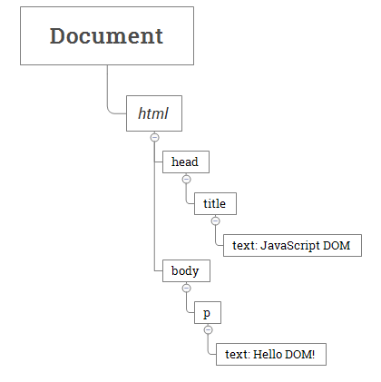
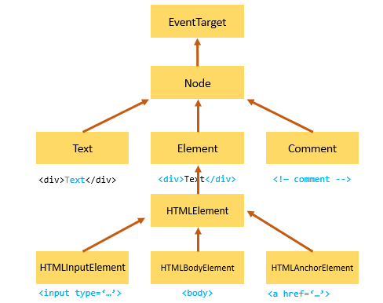
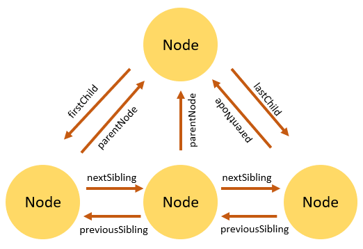

What is Document Object Model (DOM):

The Document Object Model (DOM) is an application programming interface (API) for manipulating HTML documents.
The DOM represents an HTML document as a tree of nodes. The DOM provides functions that allow you to add, remove, and modify parts of the document effectively.
The DOM represents an HTML document as a hierarchy of nodes.

<html>
    <head>
        <title>JavaScript DOM</title>
    </head>
    <body>
        
Hello DOM!

    </body>
</html>
The following tree represents the above HTML document:

In this DOM tree, the document is the root node. The root node has one child node which is the <html> element. The <html> element is called the document element.

Each document can have only one document element. In an HTML document, the document element is the <html> element.
Node Types:

Each node in the DOM tree is identified by a node type.

Constant Value Description
Node.ELEMENT_NODE 1 An Element node like 
 or 
.
Node.TEXT_NODE 3 The actual Text inside an Element or Attr.
Node.COMMENT_NODE 8 A Comment node, such as <!-- … -->.
Node.DOCUMENT_NODE 9 A Document node.

To get the type of node, you use the nodeType property:
node.nodeType

The nodeName and nodeValue properties:
A node has two important properties: nodeName and nodeValue that provide specific information about the node.
The values of these properties depend on the node type. For example, if the node type is the element node, the nodeName is always the same as the element’s tag name and nodeValue is always null.

Node and Element:
A node is a generic name of any object in the DOM tree. It can be any built-in DOM element such as the document Or it can be any HTML tag specified in the HTML document like 
 or 
.

An element is a node with a specific node type Node.ELEMENT_NODE

In other words, the node is the generic type of element.
The element is a specific type of the node with the node type as Node.ELEMENT_NODE.

All elements in the dom are nodes but all nodes are not elements;
The following picture illustrates the relationship between the Node and Element types

Notes: The getElementById() and querySelector() returns an object with the Element type while getElementsByTagName() or querySelectorAll() returns NodeList which is a collection of nodes.

Node Relationships:

